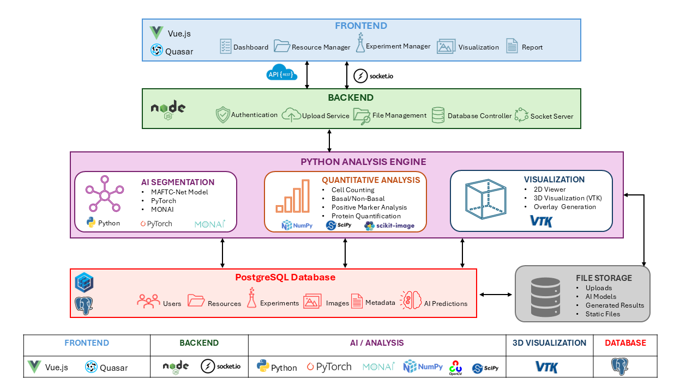

<div align="center">

# OrganixInsight

### AI-based Platform for High-Content Screening of 2D and 3D Biomedical Microscopy Images


</div>

---

## Overview

OrganixInsight is an integrated web platform for high-content screening of 2D and 3D biomedical microscopy images. It combines experiment management, deep-learning-based image analysis, visualization, statistical analysis, and database management in a unified environment.

---

## Major Features

- Resource and experiment management
- Image upload and metadata management
- AI-based 2D and 3D image segmentation
- Cell counting and morphometric analysis
- Basal/Non-basal cell classification
- Positive/Negative marker quantification
- Protein intensity measurement
- Heatmap generation
- Statistical analysis and CSV export
- Interactive VTK-based 3D visualization
- PostgreSQL database integration

---

## Table of Contents

- [Overview](#overview)
- [Major Features](#major-features)
- [System Architecture](#system-architecture)
- [Project Structure](#project-structure)
- [Software Requirements](#software-requirements)
- [Installation](#installation)
- [PostgreSQL Setup](#postgresql-setup)
- [Database Configuration](#database-configuration)
- [Running OrganixInsight](#running-organixinsight)
- [Default Network Ports](#default-network-ports)
- [Troubleshooting](#troubleshooting)
- [License](#license)
- [Contact](#contact)

---

## System Architecture

<p align="center">
  
</p>

---

## Project Structure

```text
3D_OrganixInsight/
│
├── src/                          # Frontend (Vue.js + Quasar)
│   ├── components/               # Reusable UI components
│   ├── pages/                    # Application pages
│   ├── layouts/                  # Application layouts
│   ├── router/                   # Client-side routing
│   ├── assets/                   # Images, icons, styles
│   ├── boot/                     # Quasar boot files
│   ├── utils/                    # Frontend utilities
│   └── api.js                    # API configuration
│
├── public/                       # Static web assets
├── resources/                    # Documentation figures and logos
│
├── server/                       # Node.js backend services
│   ├── config/                   # Server configuration
│   ├── controllers/              # REST API controllers
│   ├── database/                 # PostgreSQL queries
│   ├── socket/                   # Socket.IO communication
│   ├── uploads/                  # Uploaded datasets
│   ├── output/                   # Generated analysis results
│   ├── utils/                    # Backend utilities
│   ├── server.js                 # Main API server
│   ├── upload.js                 # Upload service
│   └── package.json
│
├── server/python-modules/        # AI & image analysis backend
│   ├── model_prediction/         # Deep learning models
│   ├── positive_cells_3d/        # Positive marker analysis
│   ├── flask_cell_count/         # Cell counting service
│   ├── flask_paraview/           # 3D visualization service
│   ├── images/                   # Display images
│   ├── uploads/                  # Uploaded data
│   ├── outputs/                  # Analysis outputs
│   ├── static/                   # Static visualization files
│   ├── main.py                   # Main analysis server
│   ├── app.py                    # Visualization API
│   ├── paraview.py               # VTK rendering service
│   ├── analysis.py               # Quantitative analysis
│   ├── basal_analysis.py         # Basal / Non-basal analysis
│   ├── cellcount.py              # Cell counting
│   ├── db_config.json            # Database configuration
│   └── requirements.txt
│
├── package.json                  # Frontend dependencies
├── quasar.config.js              # Quasar configuration
├── README.md
└── LICENSE
```

---

## Software Requirements

| Software | Version |
|----------|---------|
| Ubuntu | 22.04+ |
| Python | 3.10+ |
| Node.js | 20.11.0 |
| PostgreSQL | 14+ |
| Quasar CLI | Latest |

---

## Installation

### Install Node.js

```bash
curl -o- https://raw.githubusercontent.com/nvm-sh/nvm/v0.39.1/install.sh | bash

source ~/.bashrc

nvm install v20.11.0
nvm use v20.11.0
nvm alias default v20.11.0
```

Verify the installation:

```bash
node --version
npm --version
```

---

### Install Quasar CLI

```bash
npm install -g @quasar/cli
```

Verify:

```bash
quasar --version
```

---

### Create Python Environment

```bash
/usr/local/bin/python3.10 -m venv ~/py310

source ~/py310/bin/activate
```

---

### Install Frontend Dependencies

```bash
npm install
```

---

### Install Backend Dependencies

```bash
cd server

npm install
```

---

### Install Python Dependencies

```bash
cd server/python-modules

pip install -r requirements.txt
```

---

## PostgreSQL Setup

Install PostgreSQL:

```bash
sudo apt update

sudo apt install postgresql postgresql-contrib

sudo service postgresql start
```

Create the database:

```bash
sudo -u postgres createdb datacollection
```

Set the PostgreSQL password:

```bash
sudo -u postgres psql
```

Then run:

```sql
ALTER USER postgres PASSWORD '1234';
```

Enable remote access by editing:

```bash
sudo nano /etc/postgresql/14/main/postgresql.conf
```

Set:

```text
listen_addresses = '*'
```

Edit:

```bash
sudo nano /etc/postgresql/14/main/pg_hba.conf
```

Append:

```text
host all all 0.0.0.0/0 md5
```

Restart PostgreSQL:

```bash
sudo service postgresql restart
```

---

## Database Configuration

> [!NOTE]
> Update `db_config.json` with your PostgreSQL credentials before running the application.

Example `server/python-modules/db_config.json`:

```json
{
  "host": "localhost",
  "port": 5432,
  "database": "datacollection",
  "user": "postgres",
  "password": "1234"
}
```

---

## Running OrganixInsight

OrganixInsight provides helper scripts to simplify starting and stopping all services.

> [!TIP]
> The `run.sh` script launches all required services in the background and writes service outputs to log files.

### Start All Services

Execute the following command from the project root:

```bash
chmod +x run.sh

./run.sh
```

The startup script launches:

- Quasar Frontend
- Node.js Backend API
- File Upload Service
- Python Analysis Server
- Visualization Server
- VTK Rendering Service
- Cell Counting Service

---

### Stop All Services

To terminate all running OrganixInsight services:

```bash
chmod +x kill.sh

./kill.sh
```

The shutdown script stops:

- Quasar Development Server
- Node.js Backend
- Upload Service
- Python Analysis Server
- Visualization Server
- VTK Rendering Server
- Cell Counting Server

---

## Default Network Ports

The following ports are used by default and should be available before launching OrganixInsight.

| Service | Port |
|---------|------|
| Quasar Client | 8080 |
| Backend API | 8081 |
| Upload Server | 7070 |
| Socket.IO | 6080 |
| Visualization | 6085 |
| VTK Rendering | 5012 |
| PostgreSQL | 5432 |

---

## Troubleshooting

### PostgreSQL Connection Issue

Ensure that:

- PostgreSQL service is running.
- Database credentials are correct.
- `db_config.json` is configured correctly.
- Port `5432` is open.
- PostgreSQL allows remote connections if accessing from another machine.

### Python Environment Issue

Activate the Python environment before running Python services:

```bash
source ~/py310/bin/activate
```

### Port Already in Use

Find the process using a port:

```bash
sudo lsof -i :8081
```

Kill the process:

```bash
sudo kill -9 PID
```

---

## License

This software is intended for academic research and educational purposes.

For commercial licensing, please contact the authors.

---

## Contact

**Muhammad Sohaib**

Email: sohaib.cs1@gmail.com

GitHub: https://github.com/sohaibcs1/OrganixInsight

---

<div align="center">

Developed by **Muhammad Sohaib**

Biomedical Imaging • Artificial Intelligence • High-Content Screening

</div>